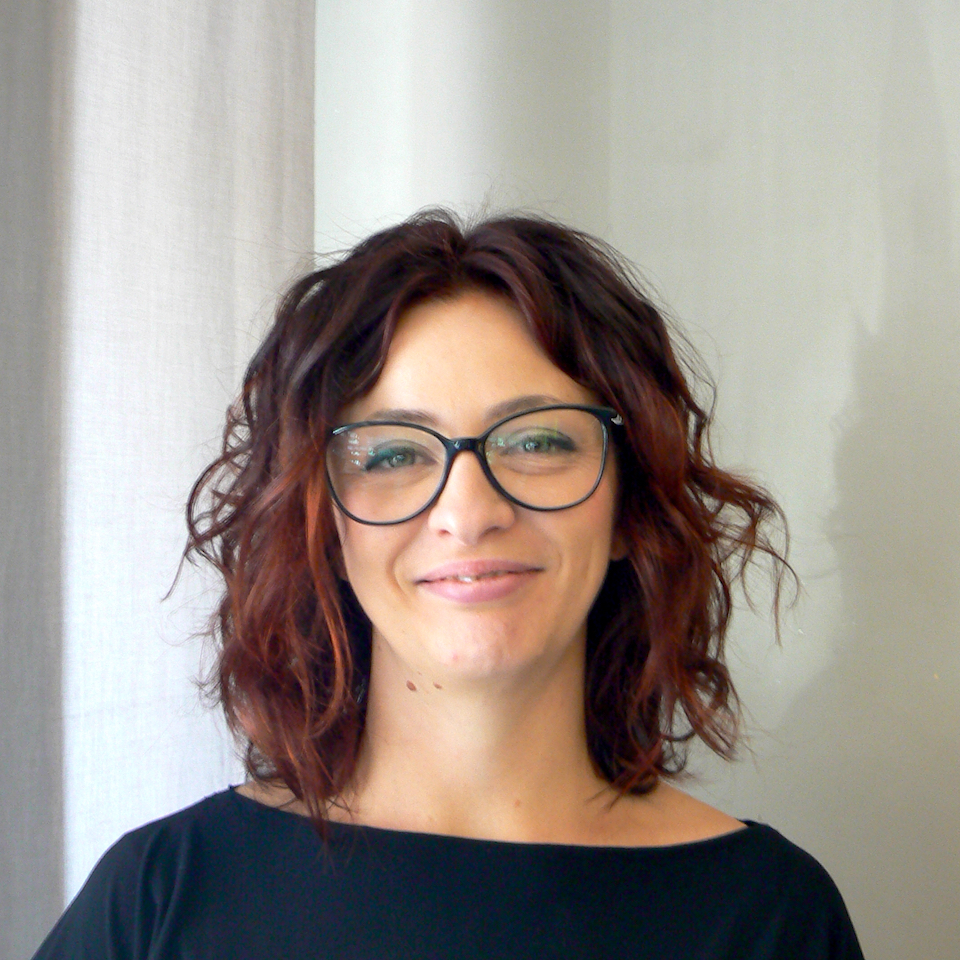

{:.image.round.right}

Ero piccolina, avevo circa 4 anni, quando scoprii questo mondo. Inizialmente adoravo giocare con i riccioli di mia mamma, mi piaceva pettinarli e sentire quanto fossero morbidi. Crescendo la passione rimase e arrivo' il momento di scegliere il mio futuro... Non avevo nessun dubbio!

Ho frequentato L'IRFOP e a fine maggio del 2000, dopo uno "stage" scolastico, fui assunta al “Pelo matto”.

Tutt’ora continuo a divertirmi con i capelli. Naturalmente la conoscenza e lo studio non terminano mai: in tutti questi anni ho frequentato molti corsi che mi hanno fatto crescere professionalmente e mi hanno dato la consapevolezza e la sicurezza nello svolgere questo lavoro meraviglioso.

I clienti si "affidano" e noi abbiamo una grande responsabilita' nei loro confronti.

Del mio lavoro cio' che mi affascina di piu' e' vedere in pochi istanti cambiare l’immagine di una persona e quanto lei ne sia soddisfatta; ma anche quando, dopo un massaggio alla testa o un trattamento rilassante, il cliente ti ringrazia per averlo coccolato così!
