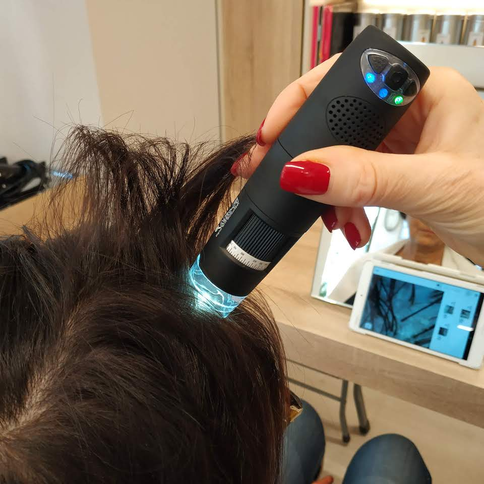

{:.image.round.right}

Sinergia check-up e' il nostro metodo di lettura per capire lo stato in cui si trova la tua cute attraverso una speciale microcamera. 
 
Molte volte cio' che il cuoio capelluto ci rivela ad occhio nudo puo' sembrare qualcosa che, andando poi ad analizzare piu' in profondita', non e' esattamente cosi'.
 
Grazie all’utilizzo della microcamera anche tu sarai in grado di vedere nello specifico come si presenta la tua cute.
Una cute in equilibrio si presenta elastica, leggermente opaca, ben irrorata con dei follicoli che contengono capelli con una uniformita' di diametro.
 
Molto spesso troviamo cuti infiammate, con un’eccessiva desquamazione ed una iperproduzione sebacea. Queste sono tutte condizioni che mettono a repentaglio la salute del capello e, se non trattate in maniera adeguata, possono diventare causa di perdita dei capelli in quanto ai follicoli viene impedita una corretta ossigenazione rendendo i capelli piu' fini, deboli e la loro fase di crescita si riduce progressivamente fino all'atrofia dei follicoli stessi. 
 
E' fondamentale togliere tutta questa tossicita' dalla cute e riportarla in uno stato di equilibrio.
Il nostro obiettivo e' proprio quello di metterti nelle condizioni di ottenere dei risultati che migliorino la condizione della tua cute grazie ai nostri trattamenti personalizzati.
 
I risultati migliori li otterremo lavorando in... Sinergia, da parte tua e da parte nostra per raggiungere lo stesso obiettivo: ottenere una cute in equilibrio e di conseguenza dei capelli dall’aspetto sano e curato!
 
Se anche tu vuoi scoprire qual'e' lo stato della tua cute prenota subito il tuo Sinergia Check Up.

