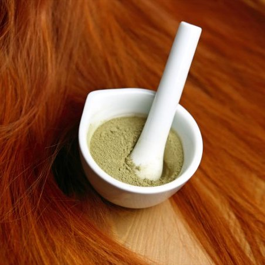

{:.image.round.right}

Perche' colorare con le piante?

Questa e' la domanda a cui vogliamo rispondere per dare una giusta connotazione a questo meraviglioso e antico metodo di colorazione.

Colorare con le piante significa utilizzare radici, fiori e foglie essiccate ridotte in polvere alle quali viene aggiunta dell’acqua, una miscela colorante naturale e biodegradabile.

Una colorazione cosi' naturale ha un modo di colorare il capello molto diverso da una colorazione chimica. 
E’ un tono su tono, cioe’ uno strato di colore che va ad aggiungersi al colore naturale del capello.
Questo e’ fondamentale per l’integrita’ dei capelli in quanto, non ricevendo l’azione dell’ossigeno che ne solleva le cuticole dello stelo per favorire lo sviluppo del pigmento, ne viene preservata la struttura naturale.

Non copre i capelli bianchi ma li maschera e non ha potere di schiaritura. Cio’ significa che se il tuo colore e' un castano, non otterrai mai un biondo! L'effetto ricrescita sara' molto piu’ sfumato e meno evidente.

Si abbassano notevolmente i rischi di tossicita’ per la cute ed in alcuni casi vengono utilizzate piante che ne migliorano la condizione. I capelli risultano ispessiti, rinforzati e molto luminosi.

Le colorazioni sono molto soggettive. Dipende molto dalla struttura del capello, dalla porosita’, dalla quantita’ di capelli bianchi, dal colore di base. La colorazione e le sfumature che si ottengono sono molto personalizzate.

Consigliamo la colorazione con le piante tintoree a tutte coloro che si approcciano per la prima volta al mondo del colore dei propri capelli, a chi vuole un prodotto naturale che rispetti la persona e l’ambiente, a chi ha problematiche di sensibilizzazione cutanea, a chi ha capelli sottili e fragili.