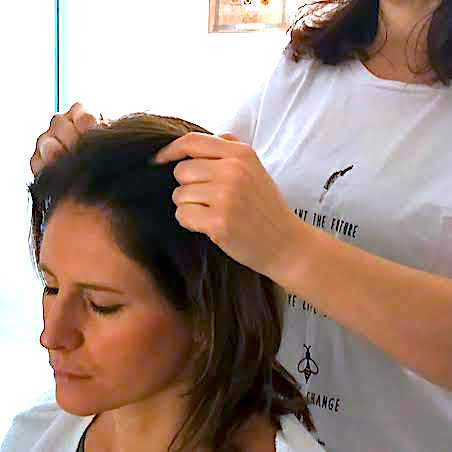

{:.image.round.right}

Secondo la Medicina Tradizionale Cinese l'energia (Qi) e' la base di ogni forma di vita e di materia nell'universo.

E' una forza dinamica in flusso costante che circola attraverso il corpo. Tutte le nostre funzioni vitali, mangiare, respirare, dormire..., sono possibili grazie all'energia all'interno del corpo.

Questa energia vitale scorre attraverso dei canali chiamati Meridiani che assicurano il coordinamento energetico tra l'interno e l'esterno, l'alto e il basso del corpo, gli organi e i visceri.
Permettono di regolare l'equilibrio fisiologico dell'energia e del sangue, dello Yin e dello Yang.

La pratica della digitopressione fonda i suoi principi teorici nel concetto di equilibrio con lo scopo di liberare l'energia bloccata, attraverso le pressioni delle dita su precisi punti del corpo, i quali corrispondono per riflesso a determinati organi, portando armonia tra mente e corpo.

La testa e' sede di importanti punti energetici che regolano le attivita' e la concentrazione della mente, di conseguenza il benessere e la salute del capello.

Con la digitopressione possiamo migliorare le anomalie cutanee quali forfora, cute secca, grassa, sensibilizzata, caduta dei capelli..., riequilibrando le energie in eccesso o in difetto.
