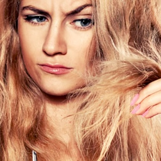

{:.image.round.right}

L’estate non e' ancora finita ma i tuoi capelli hanno gia' passato uno dei periodi piu' stressanti dell’anno. Sole, salsedine, cloro, caldo, lavaggi frequenti, uso eccessivo di elastici, contribuiscono a debilitare e a sfibrare il capello con conseguente caduta gia' ad agosto.

Durante l’estate hai provveduto ad utilizzare dei prodotti specifici di protezione, detersione e idratazione?
Se la risposta e' **NO** molto probabilmente lo stress a cui i tuoi capelli sono andati incontro sara' tutt’altro che lieve…

***<u>PERCHE’ SUCCEDE QUESTO ?</u>***
* Il clima molto caldo e umido provoca una sudorazione eccessiva della testa che facilita la proliferazione di batteri;
* Lavaggi frequenti utilizzando detergenti non professionali e non specifici causano alla cute infiammazioni persistenti;
* Il sole rende i capelli sfibrati a causa dei raggi ultravioletti che, come sulla pelle, scottano lo stelo rendendolo disidratato, opaco, difficile da gestire e ne facilita la rottura;
* La salsedine e il cloro rendono il capello secco causa principale della formazione di doppie punte e perdita del colore.

> Se in questo periodo stai notando:
> * Perdita accentuata dei capelli;
> * Fastidio al cuoio capelluto;
> * Chioma disidratata;
> * Colore opaco;
> * Piega che non tiene;
> * Doppie punte;
> * Capello secco.

***<u>COSA SUCCEDE ?</u>***

Corri subito ai ripari !!
* Avere una cute infiammata, con sebo in eccesso, desquamazione, provoca irrimediabilmente un indebolimento del capello e conseguente caduta;
* Un capello disidratato ha l’aspetto di un capello trascurato, non sano. Le cuticole rimangono aperte e non trattengono l’idratazione necessaria per avere lucentezza e corposita';
* Il colore di un capello destrutturato non risulta essere brillante e non mantiene la colorazione cosmetica a lungo;
* Un capello secco tende a spezzarsi piu' facilmente e facilita la formazione di doppie punte;
* Un capello indebolito non tiene la piega perche' manca di idratazione e struttura.

***<u>IL NOSTRO CONSIGLIO</u>***

Grazie al nostro **SISTEMA BENESSERE** siamo in grado di ridare equilibrio e benessere alla tua cute e ai tuoi capelli. Verifichiamo con l’utilizzo di una microcamera le problematiche presenti per poterti dare i consigli piu idonei e migliorare la tua situazione in maniera visibile e veloce.

Richiedi subito una consulenza gratuita **<u>solo per appuntamento dal martedi al giovedi</u>** per verificare lo stato in cui si trovano la tua cute e i tuoi capelli.
Non aspettare perche' intervenire tardi significa ottenere risultati in tempi piu' lunghi e con piu' difficolta'.

**CONTATTACI ORA !**