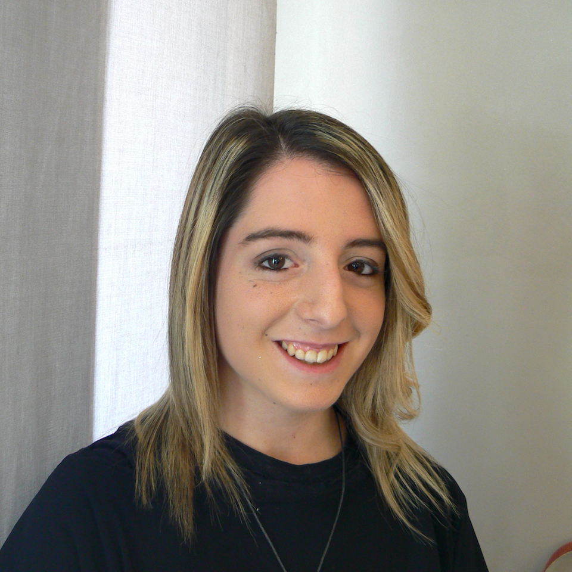

{:.image.round.right}

Avevo 3 anni, quando comincio' la voglia di creare sempre qualcosa di nuovo: frange originali su me stessa, acconciature spettacolari sulle bambole che mi regalavano.

Crescendo capii che questo lavoro avrebbe fatto parte della mia vita.

Mi sento molto creativa e molto portata a fare i massaggi alla testa dato che riesco a percepire le tensioni e ad allentarle. Da sempre il mio sogno e' quello di diventare una stilista per le spose, rendendole uniche nel loro giorno piu' importante.

E' da poco piu' di un anno che lavoro ma qui ho l'opportunita' di crescere professionalmente e ogni corso che faccio mi fa appassionare sempre di piu' al mio lavoro.

La nostra attivita' e' davvero a 360 gradi: non siamo solo stiliste dei capelli, dobbiamo anche avere una conoscenza approfondita di quello che andiamo a maneggiare ogni giorno. Ci vuole tanto studio ma il segreto e' non mollare mai perche' le soddisfazioni arrivano e vedere una cliente felice quando si vede bella e' davvero una bella soddisfazione!

Ci vogliono impegno e costanza ma riusciro' nel tempo a diventare una professionista qualificata.