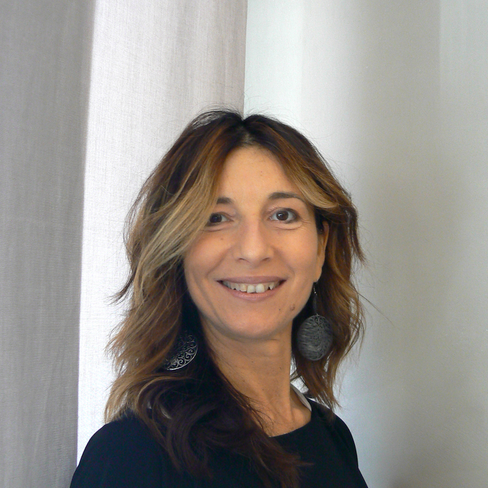

{:.image.round.right}

Grande passione per questo lavoro fin da piccola. Con una prima esperienza lavorativa di 9 anni e prendendo consapevolezza delle mie capacita', decisi di proporre a mia cugina Sabina di aprire un'attivita' insieme.

Nell'anno 2018  la ricorrenza dei nostri 20 anni lavorativi insieme...motivo di soddisfazioni e impegno costante circondate da collaboratrici come Barbara che da ben 18 anni è insieme a noi e da poco più ‘ di un anno l’arrivo di Giorgia giovanissima ma molto preparata e volenterosa che ha impreziosito il nostro lavoro collettivo.                                                                                           
Del mio lavoro cio' che mi piace e’ il contatto con la gente: ascoltando le persone capisco cosa desiderano per essere piu' belle e sicure di se stesse. Per me e' importante spiegare che l'efficacia di un trattamento e' fondamentale per il benessere del cuoio capelluto e che la bellezza del capello dipende proprio da questo.

Ho sempre pensato che fare corsi specifici e di aggiornamento siano indispensabili per offrire alla clientela sempre piu' esigente, un alto livello di professionalita'. La ricerca e lo studio del mio lavoro mi hanno portato a scegliere di utilizzare prodotti naturali, capendo quanto sia importante il rispetto dei capelli ma anche dell’ambiente.

La soddisfazione che piu' mi appaga e' vedere il cliente soddisfatto. Cio' mi gratifica per il tanto impegno e la passione che mi accompagnano da sempre.

