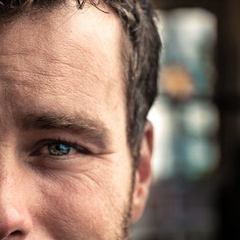

{:.image.round.right}

Come bloccare il diradamento dei capelli e favorire la ricrescita in modo facile e senza controindicazioni.

NON INTERVENIRE SIGNIFICHEREBBE ANDARE INCONTRO AD UNA SITUAZIONE BEN PIU' GRAVE E MOLTO SPESSO IRREVERSIBILE.

Adesso hai la possibilita' di migliorare notevolmente la quantita' e lo spessore dei tuoi capelli in maniera semplice, veloce ma soprattutto efficace.

Ciao, oggi ti vogliamo dare qualche informazione che ti puo' migliorare la vita a livello emotivo, sociale ed estetico.
Ti sei accorto che da tempo i tuoi capelli stanno perdendo consistenza, volume e si sono notevolmente assottigliati?

Sappi che l’ 80% della popolazione maschile e' predisposta alla comparsa di alopecia androgenetica. Questa problematica deriva da due fattori:
* PRODUZIONE DI ORMONI ANDROGENI;
* PREDISPOSIZIONE GENETICA.

**COSA ACCADE ?**
A causa della produzione di un ormone chiamato DHT (diidrotestosterone) si ha una riduzione del follicolo pilifero che tende a risalire piu' facilmente in superficie con la conseguenza di capelli che risultano piu' sottili, depigmentati, con una durata di vita inferiore e quindi una caduta precoce. Tale patologia puo' presentarsi  come alopecia androgenetica gia' tra i 16 e i 20 anni con una caduta progressiva e piuttosto veloce, dai 30 ai 50 un po’ più lenta oppure dopo i 50 come alopecia da invecchiamento.

Le soluzioni che fino ad ora il mercato farmacologico ha proposto sono legate all’utilizzo continuativo dei farmaci con gli effetti collaterali che essi comportano:
* CALO DEL DESIDERIO;
* VERTIGINI-NAUSEA;
* DISTURBI DELL’UMORE;
* IPERSENSIBILITÀ’ DEL CUOIO CAPELLUTO.

OGGI ABBIAMO UNA NOVITA' ASSOLUTA che va ben oltre a tutto cio' che fino ad oggi e' stato proposto per trattare l’alopecia:

***<u>REVITALIZING SCALP TREATMENT</u>***
* ***Cos’e'?*** - E’ UN DISPOSITIVO MEDICO, IL PRIMO TRATTAMENTO DI RICRESCITA E COADIUVANTE ALLA PREVENZIONE DEL DIRADAMENTO COMPLETAMENTE NATURALE.

* ***Quali sono gli ingredienti?*** - È COSTITUITO PRINCIPALMENTE DA:
	1. OLEUROPEINA (antiossidante ricavato dall’ulivo);
	2. RENOVASE (preparato formato da coniugato di glutatione e acidi grassi Omega 3);
	3. VITAMINA A;
	4. B SITOSTEROLO (ricavato dalla palma serenoa repens). Il tutto mescolato in una formulazione esclusiva e brevettata, depositata al centro tricologico italiano.
* ***Cosa fa?***
	1. METTE IN CONDIZIONE LA PAPILLA DERMICA DI PRODURRE CHERATINA E QUINDI IL CAPELLO;
	2. HA LA CAPACITA' DI PROMUOVERE UN COMPLETO RINNOVAMENTO CELLULARE E RINGIOVANIMENTO DEL CUOIO CAPELLUTO;
	3. NELL’ALOPECIA ANDROGENETICA MASCHILE PRESA PER TEMPO VIENE ALLUNGATO DI 20 ANNI IL PROBLEMA DEL DIRADAMENTO;
	4. FORNISCE AL CAPELLO UN ASPETTO PIU' PIENO E PIU' SANO.

Per avere una visione approfondita della tua situazione andremo a verificare, con l'ausilio di una microcamera, lo stato di salute della cute, lo spessore e la quantita' dei capelli. Questo ci aiutera' a capire se e quanto la tua cute e' intossicata,come e per quanto tempo procedere con il trattamento. Tu non dovrai fare altro che applicare il preparato a casa e questo non ti occupera' piu' di un minuto !!

Cio' che otterrai sara' gia' dal primo mese la sensazione di avere i capelli piu' corposi, noterai un progressivo rinfoltimento, una ricrescita piu' veloce, una regressione dell'alopecia e una cute ossigenata. Non ti stiamo parlando di mesi infiniti, ti possiamo dire che si ottengono degli eccellenti risultati in presenza di un alopecia piuttosto importante in soli 3 mesi !

Sappi che questa non e' una condizione che otterrai lasciando che il tempo faccia il suo corso. Intervenire tardi significa ottenere risultati in tempi piu' lunghi e con piu' difficolta'.

Se vuoi migliorare la condizione dei tuoi capelli **CONTATTACI ORA** e prenota la tua consulenza gratuita.