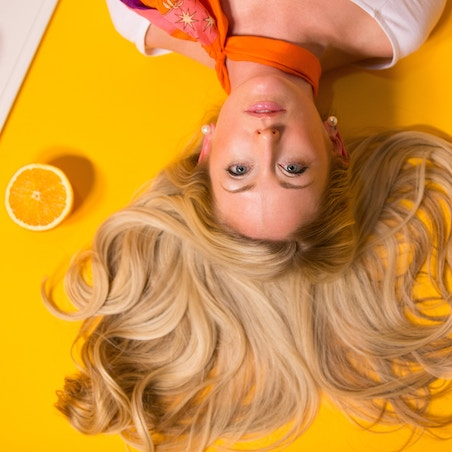

{:.image.round.right}

Ciao! Oggi vogliamo farti una domanda: Lo sai come puoi ottenere dei capelli splendidi?
Non sono solamente i trattamenti mirati alle lunghezze che rendono un capello sano...
La cosa fondamentale e’ avere una cute in equlilibrio, pulita, ossigenata!

Ti e' mai capitato dopo un periodo particolarmente stressante, dopo una malattia, un intervento chirurgico, assunzione di farmaci o dopo un periodo di disordini alimentari di accorgerti di avere la pelle arrossata, desquamata, poco luminosa e ingrigita? Ti e' mai capitato che anche il cuoio capelluto prude, si desquama, i capelli si sporcano piu' facilmente, cadono con maggiore frequenza, sono opachi e poco vitali?

Questi sono segnali che ci fanno capire che il nostro corpo ha necessita' di essere disintossicato.
Fegato, reni, intestino e pelle sono i principali organi deputati al filtraggio delle scorie e quindi e' indispensabile allegerirli per sostenere e migliorare le loro funzioni.

Un’alimentazione corretta e bilanciata e' il fondamento per riportare il nostro corpo a ritrovare un buon equilibrio, a farci sentire piu' in forza e con piu’ energia. Bere molta acqua aiuta nei processi di eliminazione delle scorie. 

Quali strategie adottare per migliorare la nostra pelle?

In sinergia con una dieta detossinante possiamo aiutare il cuoio capelluto a ritrovare equilibrio e buon funzionamento per ottenere dei capelli piu’ forti e luminosi con dei trattamenti mirati.
Il cuoio capelluto e' il prolungamento della pelle del viso e va trattato con la stessa accortezza con cui ti prendi cura della tua pelle.
La maggior parte dei disagi del cuoio capelluto e della pelle sono causati da un’errata igiene.

L’utilizzo di prodotti non idonei, troppo aggressivi, ricchi di siliconi, petrolati, tensioattivi troppo alcalini tendono ad indebolire la pelle disidratandola e lasciando residui che ne occludono i pori.
E’ fondamentale utilizzare prodotti che igienizzano  e detossinano efficacemente ma che rispettano la pelle per favorire protezione e rigenerazione di cute e capelli.

Nel nostro Sistema Benessere abbiamo inserito “Rituale detossinante”.

I prodotti che abbiamo scelto per questo trattamento di pulizia profonda del cuoio capelluto sono naturali e contengono principalmente argilla bianca, bardana ed equiseto; le stesse sostanze che vengono utilizzate anche per detossinare il nostro organismo!

- L’argilla bianca ha un elevato potere assorbente, per cui e' in grado di filtrare, assorbire e quindi eliminare sostanze tossiche come batteri, tossine e liquidi in eccesso cedendo ai tessuti i sali minerali. Svolge anche un’azione antinfiammatoria, cicatrizzante e di rinnovamento cellulare.
- L'equiseto viene utilizzato in caso di fragilita’ delle unghie, perdita dei capelli e alopecia.
- La bardana e’ impiegata per la cura delle dermatiti di vario genere, legate a disordini biologici e metabolici, dermatiti, eczema, seborrea, forfora e psoriasi, grazie alla presenza di composti dotati di proprieta' antibiotica, antibatterica e antiflogistica.

La detersione viene eseguita con una particolare manualita' che aiuta nella rimozione delle tossine. Il detergente viene scelto in base alla tipologia della cute ed e' formulato con sostanze naturali ricco di oli essenziali per pulire e proteggere la cute in piena sicurezza.
Fondamentale l’utilizzo di shampoo e conditioner specifici anche a domicilio per il mantenimento di un cuoio capelluto in equilibrio e di un capello idratato.

Vuoi conoscere lo stato di salute della tua cute?
Prenota il tuo SINERGIA CHECK UP perche’ la bellezza dei capelli comincia da una cute sana!