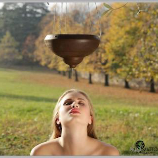

{:.image.round.right}

Ti sara' capitato di vivere periodi di stanchezza a causa di tanti impegni o situazioni emotivamente pressanti ed avrai notato che anche i capelli sono opachi, cominciano a cadere, si sporcano facilmente, oppure avverti prurito e fastidio al cuoio capelluto e la pelle del viso appare grigia e spenta.

Sono tutti segnali di un disequilibrio che non ci fanno certo sentire in gran forma.

Un'aiuto naturale ci arriva da un trattamento di origine antichissima... lo ***SHIRODARA.*** Esso nasce in India e si basa sugli antichi principi dell'Ayurveda volta ad armonizzare il corpo, la mente, i sensi e l'anima. Il nome trae le origini dal sanscrito **SHIRO** *(testa)* e **DHARA** *(flusso)*.

Il trattamento consiste in una dolce colata di olio caldo sulla fronte in corrispondenza del sesto chakra i cui organi corrispondenti sono gli occhi, la ghiandola pineale, il sistema ormonale e il sistema nervoso centrale. E' il centro dell'intuizione e dell'immagine creativa del sesto senso.

Il suo funzionamento eccessivo o insufficiente e' causa di mal di testa, problemi alla vista e neurologici, insonnia, disturbi psicologici. L'uso regolare di tale pratica riduce tali sintomi, favorisce la crescita dei capelli, migliora la microcircolazione cutanea, ha effetti positivi sul volto rendendolo piu' luminoso e disteso, riduce Il livello di tensioni muscolari e stress, riequilibra il cuoio capelluto. Lascia un profondo senso di rilassamento, la cute rigenerata ed i capelli luminosi.

***P.S: Non dimenticare che concedersi o regalare una coccola fa bene all'anima, allo spirito e alla tua bellezza!***

**NON ASPETTARE, CONTATTACI ORA !**